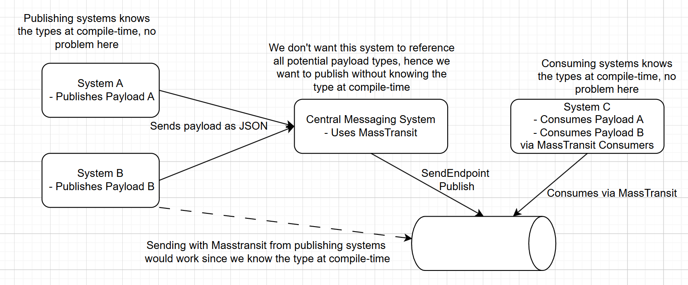
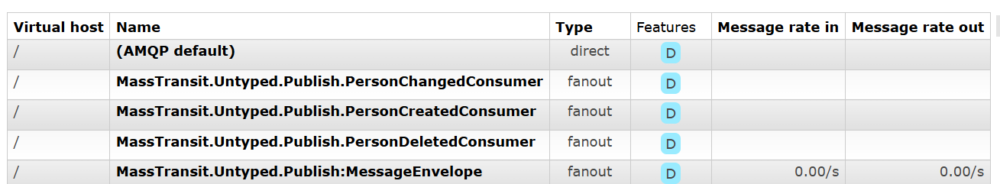
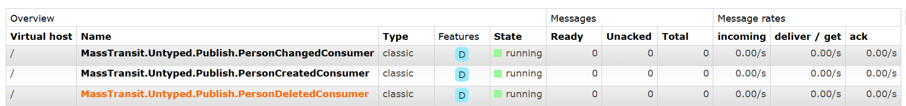
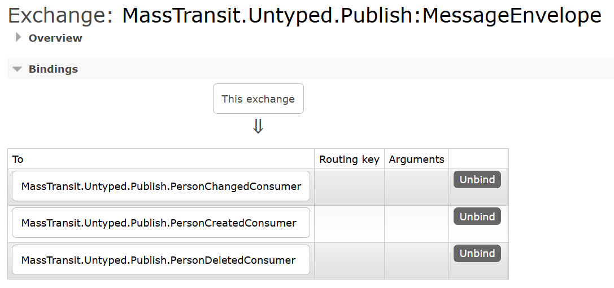

# Overview
What do we want to accomplish? We want a central system to be able to publish a generic payload, preferrably json, without it needing to acutally be able to construct the type in compile time. 

So far the only way I've accomplished this is by publishing an envelope type, that holds the event type as a stringified json, which then is deseralized in an abstract message handler that consumers needs to inherit from.

The downside from this approach is that we get one exchange (MessageEnvelope) to rule them all, instead of an exchange per payload type.

It would be nice if we could publish a json blob and specify the type as a string and still be able to receive them in strongly typed consumers, something like this:

```
System A posts pure json to central messaging system:
 - POST "{ message: "{\"Id\":\"88eafc25-3f80-4df4-8de6-1de259eb1013\",\"Name\":\"Jane Doe\"}, type: "MassTransit.Untyped.Publish.PersonCreated"}"; 

Messaging System publishes the json blob with MassTransit:
 - await bus.Publish("{\"Id\":\"88eafc25-3f80-4df4-8de6-1de259eb1013\",\"Name\":\"Jane Doe\"}", "MassTransit.Untyped.Publish.PersonCreated");

System C consumes it with a strongly typed handler:
 - class PersonCreatedConsumer : IConsumer<PersonCreated>
```



## Setup RabbitMQ
 - docker run -d --hostname my-rabbit --name rabbitmq -p 5672:5672 -p 15672:15672 rabbitmq:3-management

## Run sample
 - dotnet run

## Output
```
Bus started: rabbitmq://localhost/
[>] Published PersonCreated, PersonChanged, PersonDeleted
[x] Received PersonDeleted: 80f016d5-97b8-47e8-b11f-bc5d5f2b5e39
[x] Received PersonCreated: 80f016d5-97b8-47e8-b11f-bc5d5f2b5e39 - Ajden T.
[x] Received PersonChanged: 80f016d5-97b8-47e8-b11f-bc5d5f2b5e39 - Ajden T.
[✓] Message handled. Exiting.
Bus stopped: rabbitmq://localhost/
```
### Created exchanges


### Created queues


### MessageEnvelope bindings


### Consumer exhange binding
